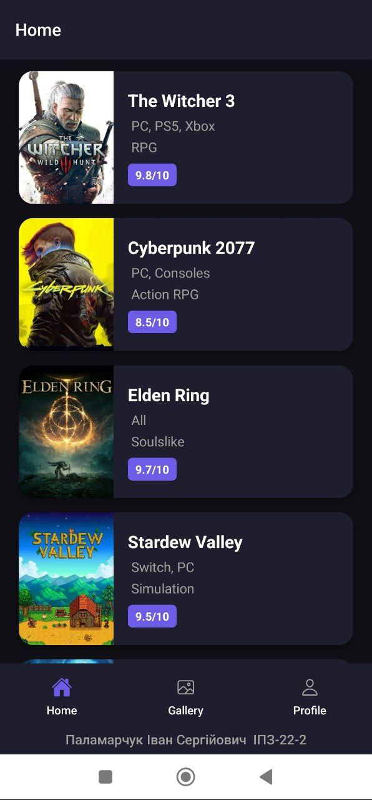
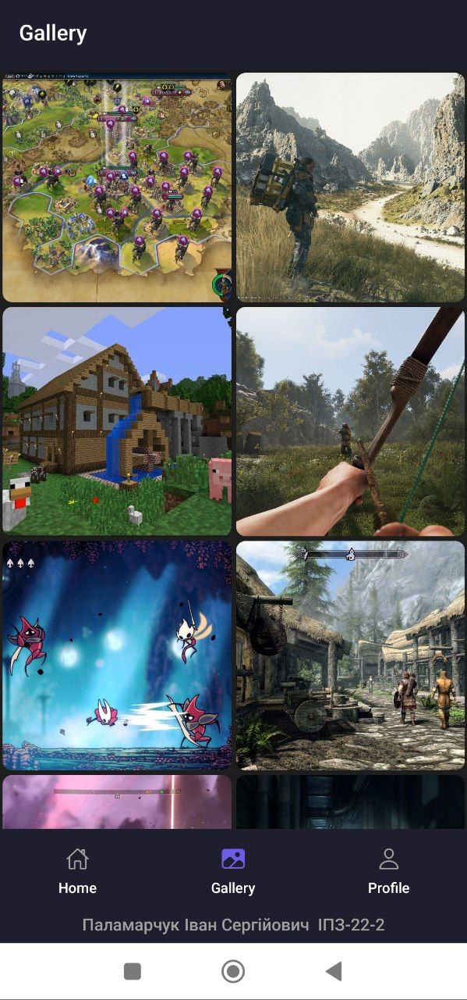
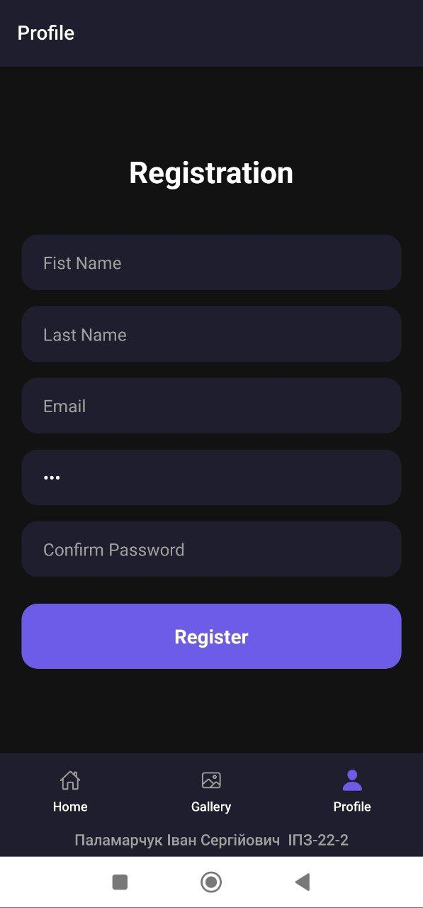

# Лабораторна робота №1

## Інструкція із запуску

1. **Встановлення залежностей:**
    ```bash
    npm install
    ```
2. **Запуск додатку:**
    ```bash
    npx expo start
    ```
3. **Сканування QR-коду в терміналі за допомогою Expo Go**    

## Скріншоти екранів
### Головна сторінка:

### Галерея зображень:

### Профіль:

## Основні способи запуску мобільного додатка

### 1. Android Emulator
Віртуальний пристрій, який запускається через Android Studio. Дозволяє тестувати додаток без реального смартфона на різних версіях Android та розмірах екранів.

**Особливості:**
- Потребує значних ресурсів RAM та CPU
- Для роботи необхідно увімкнути апаратну віртуалізацію у BIOS
- Запускається командою `npm run android` або клавішею `a` у терміналі Expo

### 2. Фізичний Android-пристрій
Підключення реального смартфона через USB із увімкненим режимом розробника та USB Debugging.

**Особливості:**
- Найточніше відображає реальну продуктивність
- Дозволяє тестувати апаратні функції
- Не навантажує ПК
- Потребує встановлення ANDROID_HOME та налаштування adb

### 3. Expo Go (фізичний пристрій через QR-код)
Мобільний застосунок, який сканує QR-код із терміналу та миттєво завантажує проєкт на телефон через мережу або тунель.

**Особливості:**
- Не потребує кабелю та складних налаштувань
- Підтримує Fast Refresh
- Для роботи поза локальною мережею використовується `npx expo start --tunnel`
- Не можна використовувати сторонні бібліотеки, які не підтримуються Expo SDK.

### 4. Expo Snack (хмарне середовище)
Онлайн-пісочниця для запуску React Native прямо у браузері без локального встановлення будь-яких інструментів.

**Особливості:**
- Не потрібні Node.js, Android Studio чи Xcode
- Підтримує одночасний перегляд на Android, iOS та Web
- Обмежені можливості порівняно з локальною розробкою

### 5. Веб-браузер (`npm run web`)
Запуск Expo-проєкту як веб-застосунку через Metro Bundler.

**Особливості:**
- Найшвидший спосіб перевірити верстку без навантаження на ПК
- Не відображає специфічну поведінку мобільних платформ
- Деякі нативні API недоступні у веб-версії