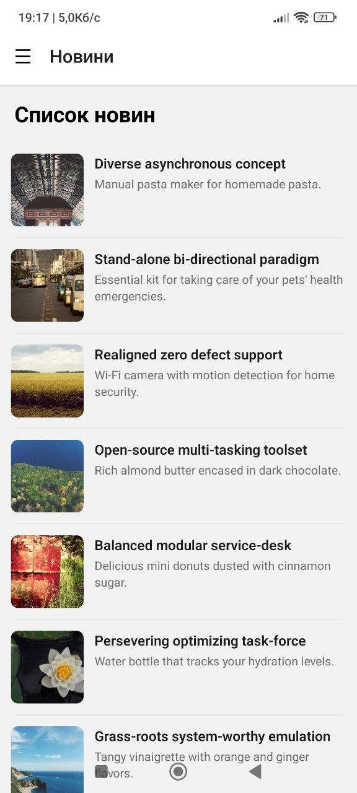
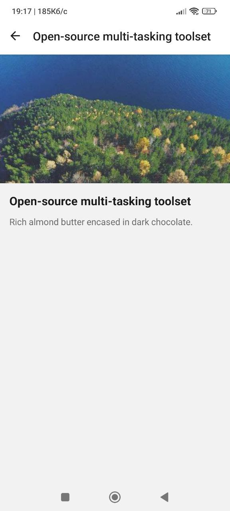
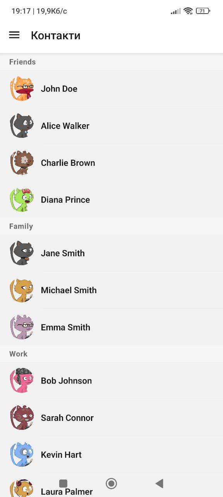
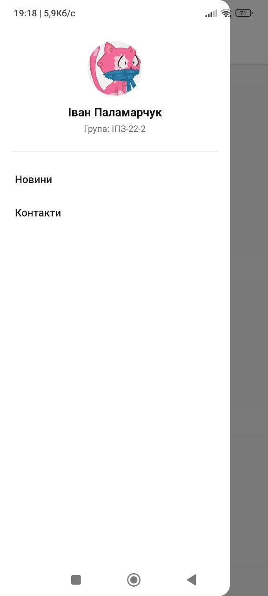

# Лабораторна робота №2

## Інструкція запуску

### Вимоги
- Node.js 18+
- Expo CLI

### Встановлення

```bash
git clone <repo-url>
cd news-app
npm install
```

### Запуск

```bash
npx expo start
```

## Реалізований функціонал

### Модель даних
- Тестові дані у `entities/news/newsMock.ts` та `entities\contact\contactsMock.ts`

### Список новин (FlatList)
- **Pull-to-Refresh** — `refreshing` + `onRefresh`, імітація запиту через `setTimeout` 1.5с
- **Infinite Scroll** — `onEndReached` + `onEndReachedThreshold`, підвантаження по 10 елементів
- **Візуальні компоненти** — `ListHeaderComponent`, `ListFooterComponent` з індикатором, `ItemSeparatorComponent`
- **Оптимізація** — `initialNumToRender={10}`, `maxToRenderPerBatch={10}`, `windowSize={5}`

### Навігація
- **Drawer Navigator** з кастомним меню
- **Stack Navigator** вкладений у Drawer для новин
- Передача параметрів між екранами (`news` об'єкт -> DetailsScreen)

### Екран контактів (SectionList)
- Контакти згруповані по категоріях: Friends, Family, Work, Gym, University

## Скріншоти


| Список новин | Деталі новини | Контакти | Drawer меню |
|---|---|---|---|
|  |  |  |  |

## Відповіді на контрольні запитання

### 1. Чим відрізняється FlatList від ScrollView?

ScrollView рендерить усі дочірні елементи одночасно при старті, незалежно від їхньої видимості, що призводить до лінійного зростання споживання пам'яті та деградації продуктивності при великих списках. FlatList використовує віртуалізацію та "лінивий" рендеринг, створюючи елементи лише за потреби та видаляючи ті, що вийшли далеко за межі екрана, що забезпечує стабільну роботу з великими масивами даних

---

### 2. Що таке віртуалізація списків?

Це архітектурний патерн, при якому рендериться лише підмножина елементів, що знаходяться у видимій частині екрана і невелика буферна зона. Для економії ресурсів компоненти поза цією зоною знищуються, а їхнє місце замінюється порожніми контейнерами для збереження коректної поведінки прокрутки.

---

### 3. Як здійснюється передача параметрів між екранами?

Дані передаються як другий аргумент у методах навігації navigate() або push()

```ts
// Відправляємо
navigation.navigate('Details', { news: newsItem });

// Отримуємо
const { params: { news } } = useRoute<RouteProp<NewsStackParams, 'Details'>>();
```

---

### 4. Що таке вкладена навігація?

Розміщення одного навігатора всередині іншого. В цьому проєкті зовнішній, відповідає за бокове меню, a вкладений відповідає за перехід між екранами новин.

---

### 5. У яких випадках застосовується SectionList?

SectionList використовується для відображення даних, згрупованих за певним критерієм, коли потрібно виводити заголовки секцій. Типові випадки застосування: контактні книги (групування за алфавітом), меню ресторанів (категорії страв) або історія транзакцій (групування за датами)