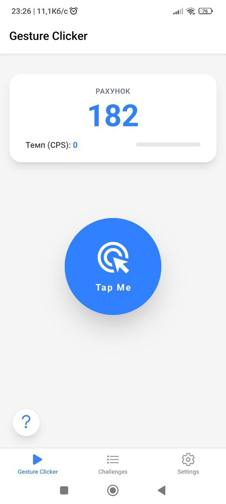
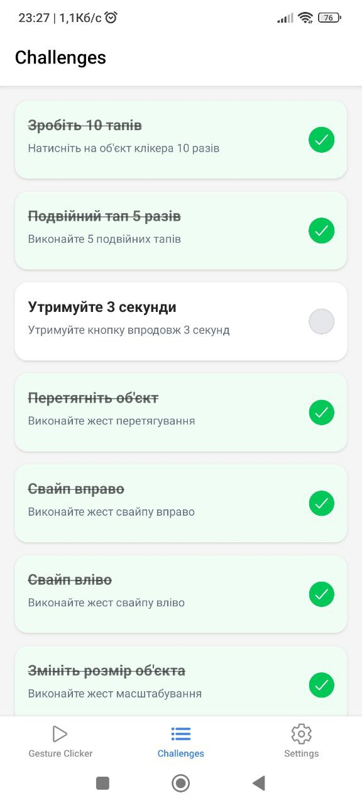
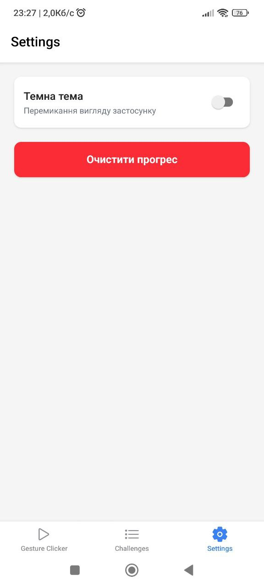
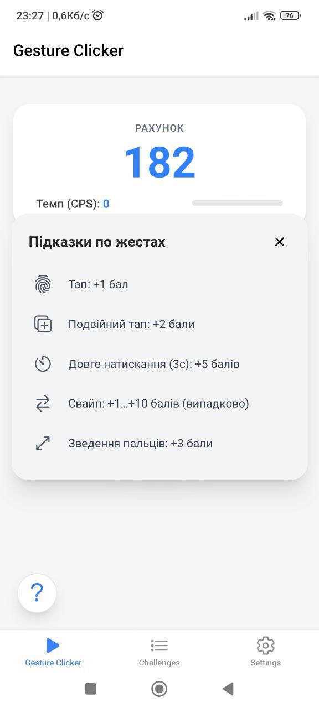

# Лабораторна робота №3

## Запуск

1. Встановити залежності:

```bash
   npm install
```

2. Запустити проєкт:

```bash
   npx expo start
```

3. Відсканувати QR-код у застосунку **Expo Go** на телефоні,
   або натиснути `a` для Android-емулятора / `i` для iOS-симулятора.

## Реалізований функціонал

### Головний екран

Центральний інтерактивний об'єкт підтримує 6 типів жестів:

- Тап
- Подвійний тап
- Довге натискання
- Свайп вліво / вправо
- Перетягування
- Зведення пальців

### Екран завдань

Список із 9 завдань з статусом виконання для кожного.
Статус оновлюється автоматично під час гри.

### Екран налаштувань

Скидання прогресу та перемикач світлої / темної теми.

### Навігація

Bottom Tab Navigator з трьома вкладками.

## Скріншоти

| Головний екран                       | Екран завдань                          | Екран налаштувань                            | Pop-Up з підказками                    |
| ------------------------------------ | -------------------------------------- | -------------------------------------------- | -------------------------------------- |
|  |  |  |  |

## Висновки

Навчився працювати з жестами користувача у мобільному
застосунку, реалізував взаємодію через різні типи жестів та застосував
сучасні підходи стилізації у React Native.
