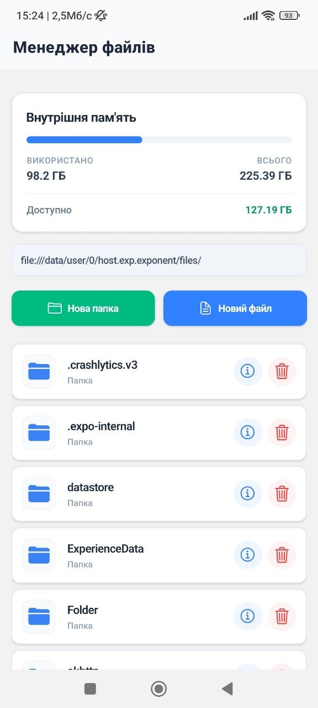
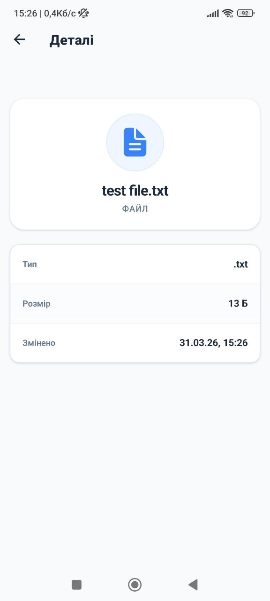
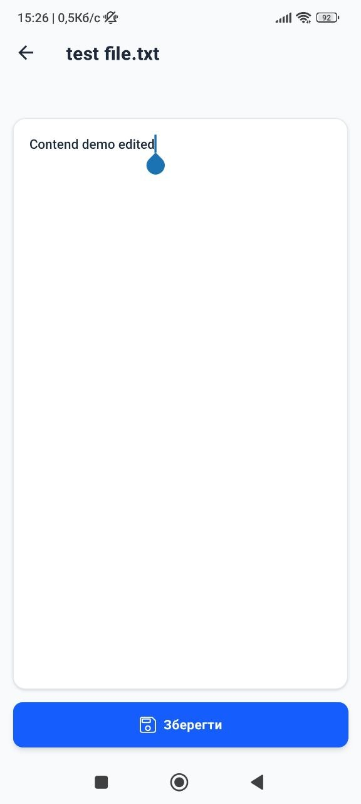
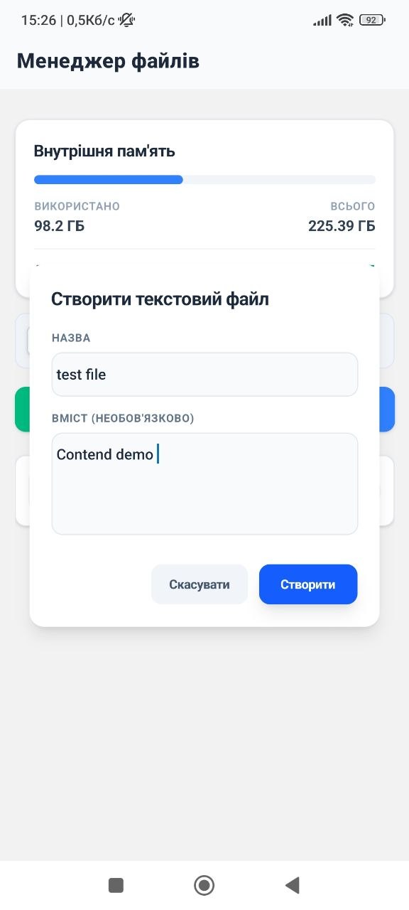

# Лабораторна робота №4

## Інструкція із запуску

1. Встановити залежності:

```bash
   npm install
```

2. Запустити проєкт:

```bash
   npx expo start
```

3. Відсканувати QR-код у застосунку **Expo Go** на телефоні,
   або натиснути `a` для Android-емулятора / `i` для iOS-симулятора.
## Функціонал

**Перегляд файлів**
- Перегляд внутрішнього сховища пристрою
- Навігація у підпапки та назад через панель шляху
- Папки завжди відображаються першими, далі файли за алфавітом

**Керування файлами та папками**
- Створення папок з довільною назвою
- Створення `.txt` файлів з необов'язковим початковим вмістом
- Видалення файлів та папок із підтвердженням дії

**Текстовий редактор**
- Відкриття та редагування `.txt` файлів
- Збереження змін

**Деталі файлу**
- Перегляд назви, типу, розміру та дати останньої зміни у модальному екрані

**Статистика пам'яті**
- Відображення використаного, вільного та загального обсягу сховища з індикатором заповненості

## Скріншоти

| Головний екран                       | Деталі файлу                          | Редактор                            | Створення                    |
| ------------------------------------ | -------------------------------------- | -------------------------------------------- | -------------------------------------- |
|  |  |  |  |
