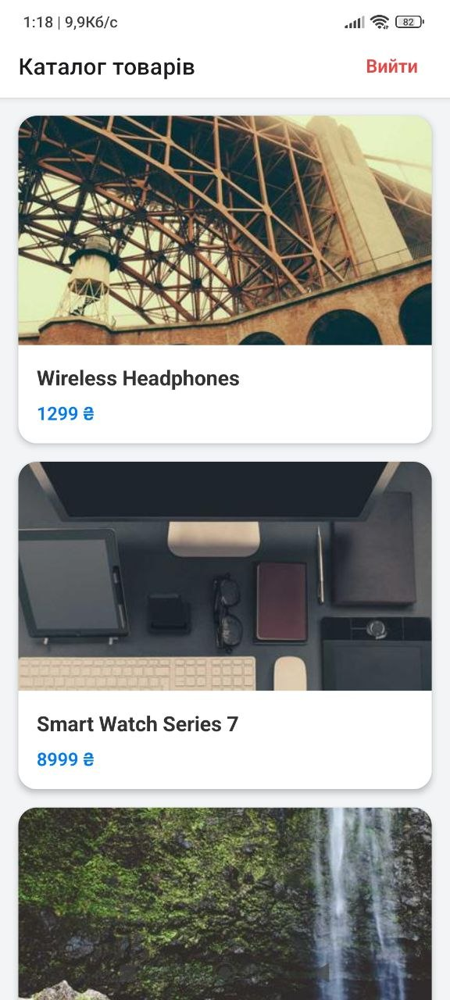
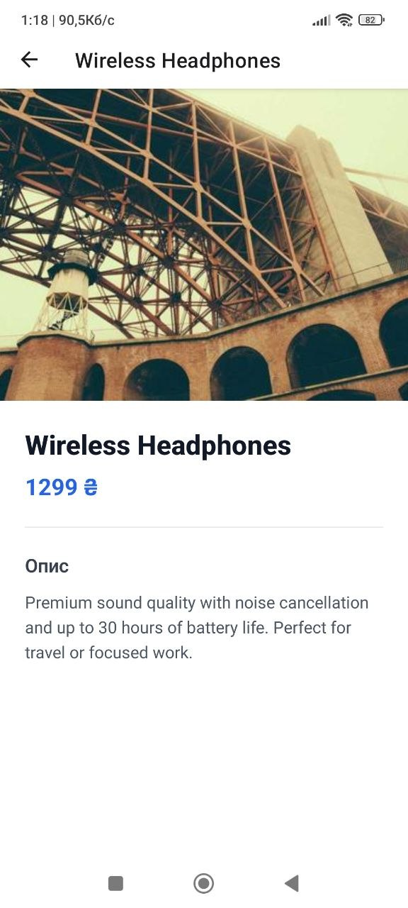

# Лабораторна робота №5 — Expo Router Navigation

Мобільний застосунок каталогу товарів із авторизацією, побудований на React Native та Expo Router.

---

## Інструкція запуску

1. Встановити залежності:

```bash
   npm install
```

2. Запустити проєкт:

```bash
   npx expo start
```

3. Відсканувати QR-код у застосунку **Expo Go** на телефоні,
   або натиснути `a` для Android-емулятора / `i` для iOS-симулятора.

---

## Функціонал

| Функція                 | Файл                         | Опис                                                           |
| ----------------------- | ---------------------------- | -------------------------------------------------------------- |
| Авторизаційний контекст | `context/AuthContext.tsx`    | `isAuthenticated`, `login()`, `register()`, `logout()`         |
| Екран входу             | `app/(auth)/login.tsx`       | Email + пароль, валідація, посилання на реєстрацію             |
| Екран реєстрації        | `app/(auth)/register.tsx`    | Ім'я + email + пароль + підтвердження, перевірка збігу паролів |
| Захищена навігація      | `app/(app)/_layout.tsx`      | `<Redirect href="/login" />` якщо не авторизований             |
| Каталог товарів         | `app/(app)/index.tsx`        | `FlatList` з 10 товарами, кнопка виходу                        |
| Деталі товару           | `app/(app)/details/[id].tsx` | `useLocalSearchParams()` для отримання `id`, повна інформація  |
| Сторінка 404            | `app/+not-found.tsx`         | Повідомлення + кнопка повернення на головну                    |

---

## Скріншоти

| Вхід                                   | Реєстрація                                   | Каталог                                    | Деталі товару                              |
| -------------------------------------- | -------------------------------------------- | ------------------------------------------ | ------------------------------------------ |
|  |  |  |  |

---

## Відповіді на контрольні запитання

### 1. Як реалізується перенаправлення неавторизованого користувача?

У файлі `app/(app)/_layout.tsx` перевіряється значення `isAuthenticated` з контексту. Якщо воно `false`, повертається компонент `<Redirect href="/login" />`, який Expo Router автоматично обробляє як навігаційний перехід ще до рендерингу захищених екранів.

```tsx
if (!isAuthenticated) {
  return <Redirect href="/login" />;
}
```

### 2. Різниця між `<Link>` та `router.push()`

| `<Link>`                        | `router.push()`                       |
| ------------------------------- | ------------------------------------- |
| Декларативний підхід            | Програмний підхід                     |
| Рендерить дочірній компонент    | Викликається в коді (обробники подій) |
| Використовується в JSX-розмітці | Зручний для умовної навігації         |
| Підтримує `asChild` prop        | Недоступний у JSX напряму             |

### 3. Як працюють динамічні маршрути?

Файл `app/(app)/details/[id].tsx` реєструє маршрут `/details/:id`. При переході на `/details/3` Expo Router автоматично передає `{ id: '3' }` як параметри маршруту. Для їх отримання використовується хук:

```tsx
const { id } = useLocalSearchParams();
const product = products.find((p) => p.id === id);
```

### 4. Чому стан авторизації зберігається у глобальному контексті?

Локальний стан компонента (`useState`) живе лише до його розмонтування. При навігації між екранами компоненти монтуються/розмонтуються, що призвело б до втрати стану авторизації. React Context зберігає стан на рівні дерева компонентів незалежно від навігації, що забезпечує доступ до `isAuthenticated` з будь-якого екрану без передачі пропсів.

### 5. Для чого використовуються групи маршрутів `(folderName)`?

Групи маршрутів (`(auth)`, `(app)`) — це спосіб логічно організувати екрани без впливу на URL-адресу. Наприклад, файл `app/(auth)/login.tsx` доступний за адресою `/login`, а не `/auth/login`. Це дозволяє застосовувати різні `_layout.tsx` для публічних та захищених екранів, не змінюючи структуру URL.
