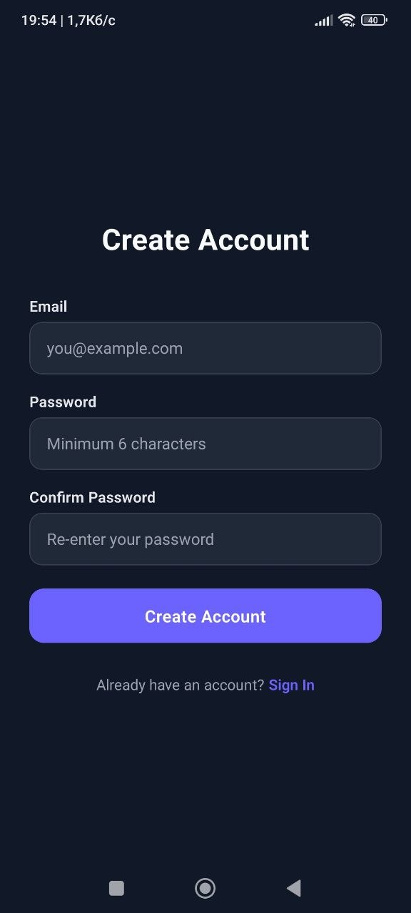
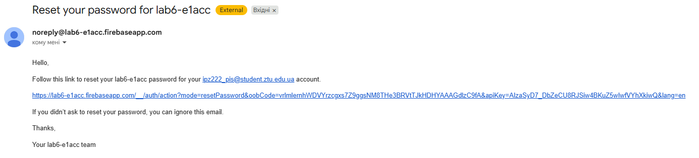

# Лабораторна робота №6

## Інструкція із запуску

1. Встановити залежності:

```bash
npm install
```

2. Налаштувати файл `.env` у корені проєкту (з `EXPO_PUBLIC_` префіксами).

3. Запустити проєкт:

```bash
npx expo start
```

## Функціонал та завдання

1. **Автентифікація користувача:**
   - Реєстрація нових користувачів та вхід існуючих за допомогою Email/Password.
   - Вихід із системи та відновлення пароля через email за допомогою Firebase API.
2. **Збереження та редагування даних:**
   - Форма заповнення/оновлення профілю: Ім’я, Вік, Місто.
   - Дані зберігаються у колекції users в документах, ID яких відповідає uid користувача.
3. **Захист доступу та безпека:**
   - Захищена навігація через Expo Router з використанням груп (auth) та (app).
   - Глобальне керування станом через AuthContext.
   - Валідація доступу до даних на рівні клієнтського коду та серверних правил Firestore Security Rules (доступ лише до власного uid).
4. **Редагування та видалення облікового запису:**
   - Кнопка "Видалити акаунт" з підтвердженням та повторною автентифікацією.
   - Оновлення даних профілю через форму з миттєвим збереженням у Firestore.

## Скріншоти

| Вхід                                   | Реєстрація                                   | Форма редагування                    | Налаштування                                 | Відновлення пароля                                   |
| -------------------------------------- | -------------------------------------------- | ------------------------------------ | -------------------------------------------- | ---------------------------------------------------- |
|  |  |  |  |  |

**Лист з відновленням пароля:**



## Висновки

Набув практичних навичок інтеграції авторизації та обробки персональних даних користувача в мобільному застосунку.
